<!-- This file includes all the solutions to InterviewBit Problems on Time Complexity.
 Link: https://www.interviewbit.com/courses/programming/topics/time-complexity/  -->

## 1. LOOP_CMPL  

The correct answer is:  
Time Complexity: O(N+M)  
Space Complexity: O(1)

Explanation: The first loop is O(N) and the second loop is O(M). Since you don't know which is bigger, you say **this is O(N + M)**. This can also be written as O(max(N, M)).

Since there is no additional space being utilised, the space complexity is constant or O(1)

## 2. NESTED_CMPL  
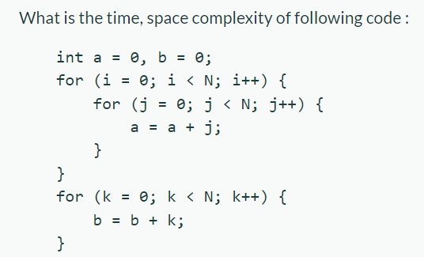

The correct answer is:  
Time Complexity: O(N*N)  
Space Complexity: O(1)

Explanation: The first set of nested loops is O(N^2) and the second loop is O(N). 

This is O(max(N^2,N)) which is O(N^2). 

## 3. NESTED_CMPL2   
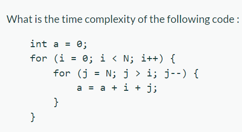

The correct answer is:  
Time Complexity: O(N*N)  

Explanation: Total number of runs = N + (N - 1) + (N - 2) + ... 1 + 0

= N * (N + 1) / 2

= 1/2 * N^2 + 1/2 * N

= O(N^2) times. 

## 4. CHOOSE4   

The correct answer is:  
X will always be a better choice for large inputs  

Explanation: In asymptotic analysis we consider growth of algorithm in terms of input size. An algorithm X is said to be asymptotically better than Y if X takes smaller time than y for all input sizes n larger than a value n0 where n0 > 0.

## 5. WHILE_CMPL  

The Correct Answer is:  
Time Complexity: O(Log N)  

Explanation: We have to find the smallest x such that `N / 2^x < 1 OR 2^x > N`

x = log(N)

=> N -> N/2 -> N/4 -> N/8 -> .... 0  
=> 2^a = N (Assuming that we can divide N by 2 for 'A' number of times)  
=> Log 2^a = Log N (Taking Log Base 2 both sides)  
=> a Log 2 = Log N (Log 2 Base 2 = 1)  
=> a = Log N  

## 6. NESTED_CMPL3  
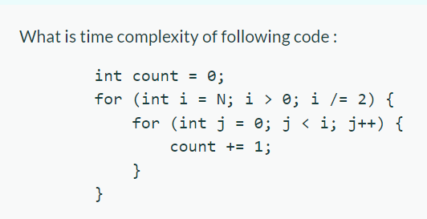

The Correct Answer is:  
Time Complexity: O(N)  

Explanation: 

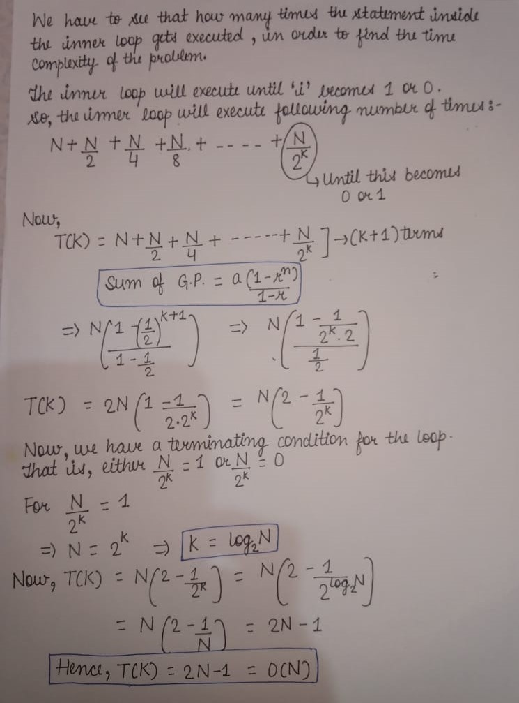

## 7. LOOP_CMPL2  
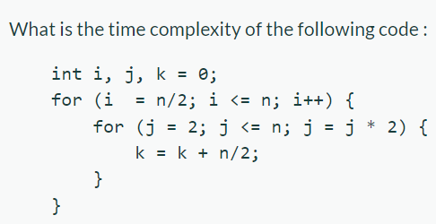

The Correct Answer is: &Theta;(nLogn)  

Explanation:  

Outer Loop Analysis:  
i = n/2 to n with increment by 1. Hence this loop will just n/2 times.  

Inner Loop analysis:  
j = 2 to n but with multiplication by 2.  

Let’s approach this mathematically.  

2^k = n this means that j = 2 after multiplying k times will reach n.  

For example, if n = 8 then the inner loop will iterate 3 times. If n = 16 inner loop will iterate 4 times and so on. Basically, it’s log.  

What is the value of k? Just take log  

=> 2^k = N (Assuming that we can divide N by 2 for 'K' number of times)  
=> Log 2^k = Log N (Taking Log Base 2 both sides)  
=> k Log 2 = Log N (Log 2 Base 2 = 1)  
=> k = log N (Base 2)  

hence inner loop will iterate logn times  

Total complexity (N/2)logN = NlogN as we don’t care about constants in asymptotic notations.  

## 8. GCD_CMPL  
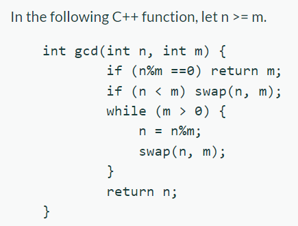

The Correct Solution is: &Theta;(logn)  

Explanation: 

## 9. CHOOSE1  
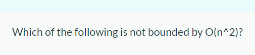

The Correct Answer is: n^3 / (sqrt(n))  

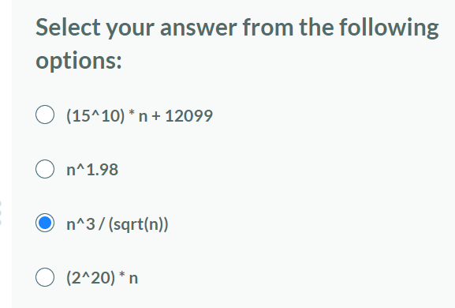  

Explanation: We assume n to be infinetly larger than any integer. (As we have to consider the worst case complexity.)  
So, Option 1 ~ O(N) which is less than (<) O(N^2) (NOT POSSIBLE)  
Option 2 => N^1.98 < N^2 (NOT POSSIBLE)  
Option 3 => N^3 / (sqrt(N)) or N^2.5 (POSSIBLE)  
Option 4 => 2^20 * N <= 2^20 * N^2 (NOT POSSIBLE)  

## 10. CHOOSE2  
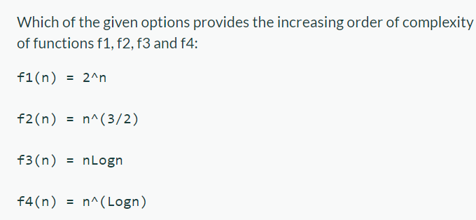

The Correct Answer is: f3, f2, f4, f1  

Explanation: Try to look at the values for functions for very large value of n.  
2^N  
N^(3/2) ~ N^(sqrt 2)  
NLogN  
N^(LogN)  

## 11. CHOOSE3  
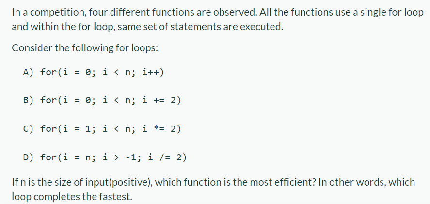

The Correct Answer is: Statement C  

Explanation: The time complexity of the first for loop is O(n).   
The time complexity of the second for loop is O(n/2), equivalent to O(n) in asymptotic analysis.  
The time complexity of the third for loop is O(logn).  
The fourth for loop doesn't terminate.  

## 12. REC_CMPL1  
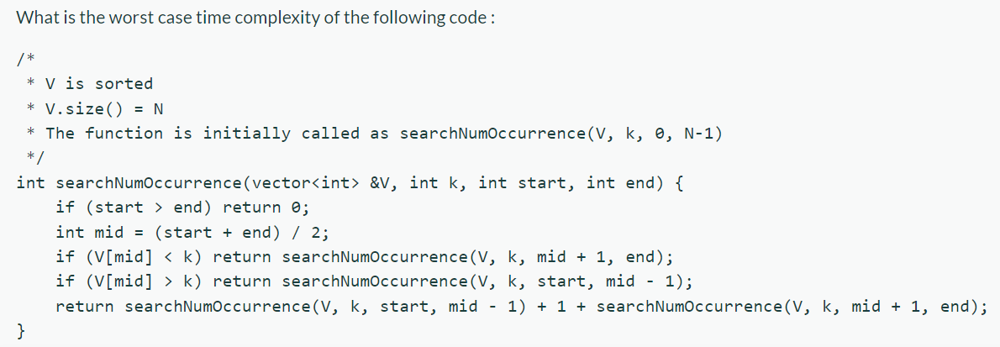

The Correct Answer is:  
Time Complexity: O(N)  

Explanation: It is something like Binary Search, but if you look closely, it is not even searching the element since there is no condition of equality for element at arr[mid] and ‘k’.  
At the first glance, we thought it to be O(Log N). But, Consider a case when all the elements in the vector are same say 2. Also, value of k is 2. Now run the algorithm, in the first call to that function, it will directly go to the final return statement after calculating mid, which traverse both branches for each node.  

In such way whole tree is traversed. Hence the Time Complexity is O(N)  

## 13. REC_CMPL2  
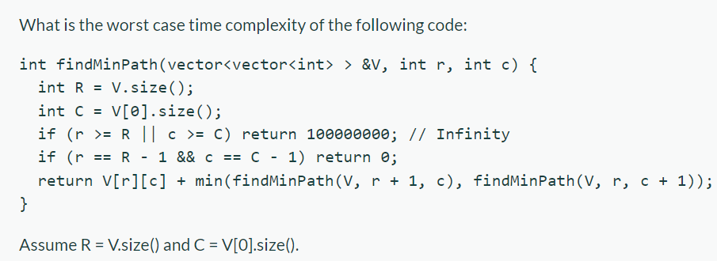

The Correct Answer is:  
Time Complexity: O(2^(R + C))  

Explanation: Note that in every function call, we end up making 2 calls.

So, the function calls ends up looking like a tree :

                   F(0,0)
                /          \ 
            F(0, 1)         F(1, 0)
             /    \         /       \ 
          F(0, 2)  F(1,1)  F(1, 1)  F(2, 0)
             ....
The function calls end up making a complete binary tree.

  Number of calls on Level 0 = 1
  Number of calls on Level 1 = 2
  Number of calls on Level 2 = 4
  ...
  Number of calls on level i = 2^i. 
Total number of calls = 1 + 2 + 4 + ... 2^i + ... 2^(M + N - 2)  
                      = O(2^(M + N))

## 14. REC_CMPL3  
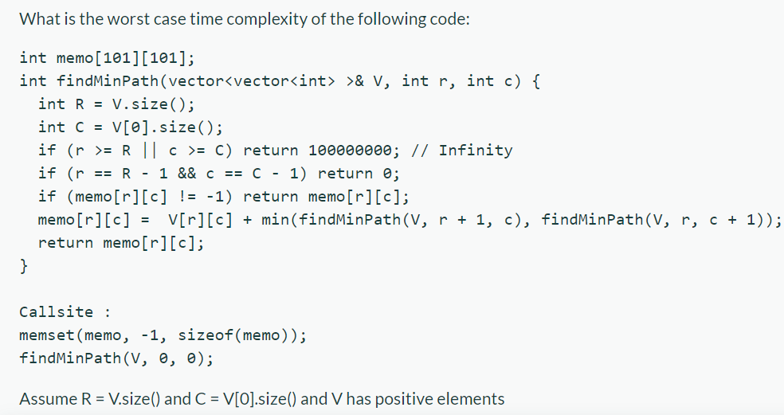

The Correct Answer is:  
Time Complexity: O(R*C)  

Explanation: Note that for a given `(r, c)`
 
the following code will not be executed more than once : 

memo[r][c] =  V[r][c] + min(findMinPath(V, r + 1, c), findMinPath(V, r, c + 1));

Once memo[r][c] is set, the functions will return at 

if (memo[r][c] != -1) return memo[r][c];

So, every function ends up calling other functions at most 1 time. 
In other words, every function ends up executing atmost O(1) times (Note that you can shift the part about checking for memo[r][c] != -1 at the callsite ).

Initially it starts from (0,0) ,From here it has two moves

- either moves right
- or moves down

So, we may come across the same position many times but here we across one position for one time .

This is because , before going to a position we check whether this is first time or not by checking MEM array i.e. if MEM[ i , j ] = -1 (first time) or else we have already reached it. So, total Position = R * C

Total Time=

T(0,0) + T(0,1) + T(0,2) + … T(0,C-1) +

T(1,0) + T(1,1) + T(1,2) + … T(1,C-1) +

.

.

.

.

T(R-1,0) + T(R-1,1) + T(R-1,2) + … T(R-1,C-1);

= O( R * C);  
`O(R * C)` possible number of combinations are possible for `(r, c)`  
Hence, the time complexity of the function : O(R*C)

## 15. AMORTIZED1 
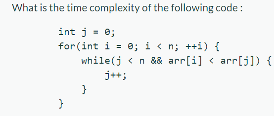

The Correct Answer is:  
Time Complexity: O(N)  

Explanation: There will be 2 cases: 
- the array with increasing values: For this as the j=0 condition is given above the ‘for’ loop, once the value of J reaches n-1, it wont be back to 0 so, it won’t run further.

- the array with non-increasing(all equal or decreasing) : Here the for loop will run and check the while loop for each value of the array as the while loop wont be executed.

Here the main trick is that j is declared as the global variable. and the array is just for the confusion it is of no use.

Now let’s say in 1st iteration in the worst-case let’s say j runs for n times. Now for the 2nd iteration, it won’t be 0 again it will remain n because the global variable is changed.

Therefore for every other iteration, it won’t enter the while loop therefore total time taken.

Statement 1 - 1unit

Statement 2 - N times

Statement 3 - 1 unit (Only for the first iteration when i=0)

Statement 4 - 1 unit

Total time = 1+N+1+1

Therefore worst-case time complexity is O(N).

